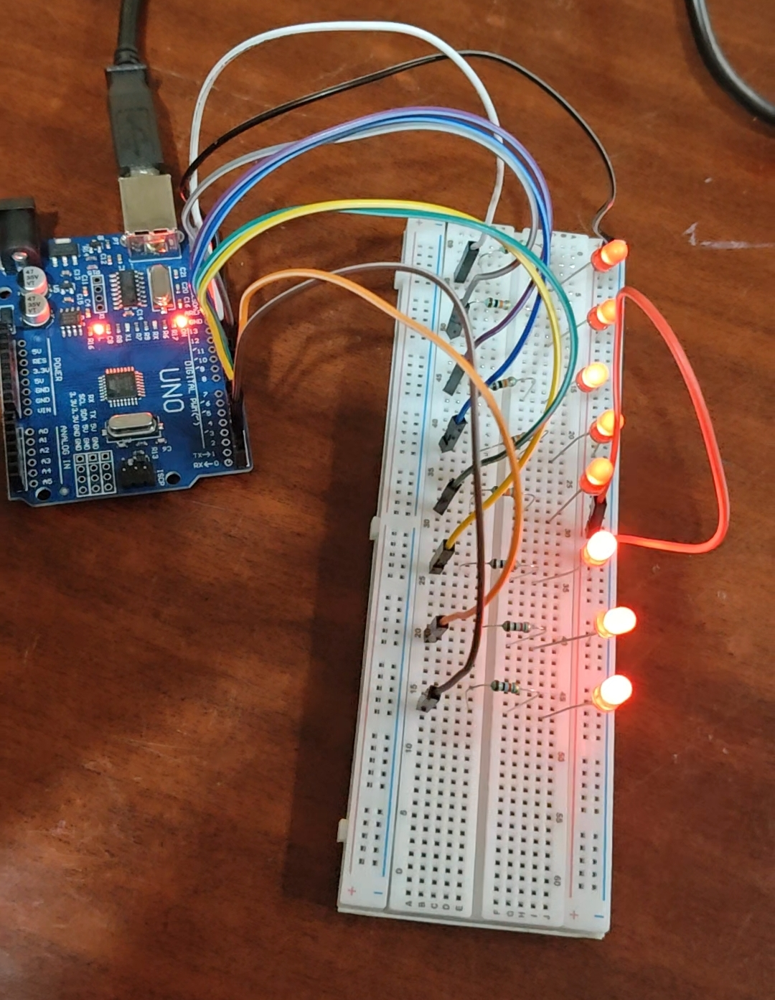

# 🔆 LED 8 Blink – Arduino Mini Project 🚀

Hey there! This is a basic but cool Arduino project where I made **8 LEDs blink** in sync using digital pins 2 to 9.  
It helped me understand how to work with GPIO pins and troubleshoot real circuit issues.  
Pretty fun and full of learning moments! 😄

---

## 🧰 Components I Used:

- Arduino UNO board
- 8x Red LEDs
- 8x 220Ω resistors
- Breadboard
- Jumper wires
- USB cable for power

---

## ⚡ Circuit Connection Diagram:

Here’s how I wired it all up on the breadboard ⬇️  

> Each LED is connected to digital pins 2 to 9 through a resistor, with the cathode going to GND.

---

## 💡 What This Project Does:

- All 8 LEDs turn **ON for 1 second**, then turn **OFF for 1 second**
- This blinking pattern continues in a loop
- Helps understand how `pinMode()`, `digitalWrite()`, and `delay()` work in Arduino

---

📂 [Click here to view the Arduino Code (.ino file)](8LEDs.ino)

---

🖼️ Preview:

---

🧠 What I Learned:
How to use pinMode() and digitalWrite() for output control

Connecting LEDs correctly on a breadboard

Real-world debugging (like wrong pin issues 😅)

Creating and saving projects on GitHub

---

## 🙋‍♂️ About Me:
👨‍💻 Project by: Priyansh Singh
📅 Date: July 2025
🌐 [Visit my GitHub Profile](https://github.com/priyansh244)

